# EditorPowertools

A collection of power tools for Optimizely CMS 12 editors and admins. Distributed as the NuGet package `CodeArt.Optimizely.EditorPowertools`.


## Tools

| Tool | Description |
|------|-------------|
| **Content Type Audit** | Audit all content types, usage counts, properties (inherited/defined/orphaned), inheritance tree. CSV export. |
| **Personalization Audit** | Find where audiences are used across the site - access rights, content areas, XHTML fields. Scheduled job. |
| **Audience Manager** | Manage audiences with search, category filtering, criteria details, and usage statistics. |
| **Content Type Recommendations** | Define rules for which content types are suggested when creating content under specific parents. |
| **Bulk Property Editor** | Inline-edit property values across multiple content items. Filter, sort, paginate, bulk save/publish. |
| **Scheduled Jobs Gantt** | Interactive Gantt chart of scheduled job execution history with zoom, scroll, and planned future runs. |
| **Activity Timeline** | Dual-column timeline of editorial activities with comments, version comparison, and infinite scroll. |
| **Link Checker** | Scan content for broken internal and external links. Friendly URLs, status codes, easy edit-mode access. |
| **Power Content Details** | Assets panel widget showing detailed info about the currently selected content item. |
| **Active Editors** | Real-time editor presence, see who's editing what, team chat, and CMS notifications via SignalR. |
| **Content Importer** | Import content from CSV, Excel, or JSON with field mapping, preview, and validation. |
| **CMS Doctor** | Pluggable health check dashboard with auto-fix capabilities. |
| **Content Audit** | Comprehensive content inventory with configurable columns, filters, and export. |
| **Manage Children** | Bulk operations on child content items from the navigation tree. |

## Screenshot Gallery

### Overview Dashboard
The main dashboard showing all available tools with quick-access cards.


### Content Type Audit
Audit all content types with usage counts, property details (inherited, defined, orphaned), and inheritance tree visualization. Includes CSV export and drill-down dialogs.

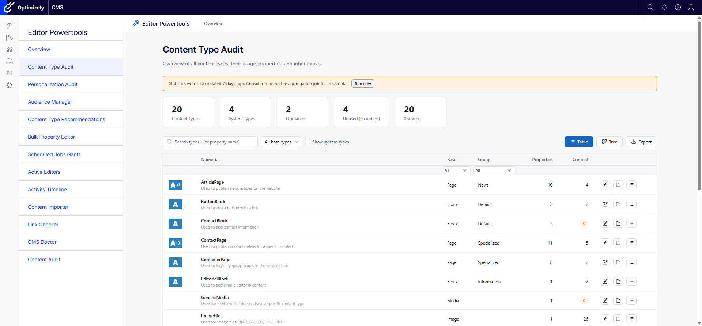

### Personalization Audit
Discover where visitor groups (audiences) are used across the site, including access rights, content areas, and XHTML fields.

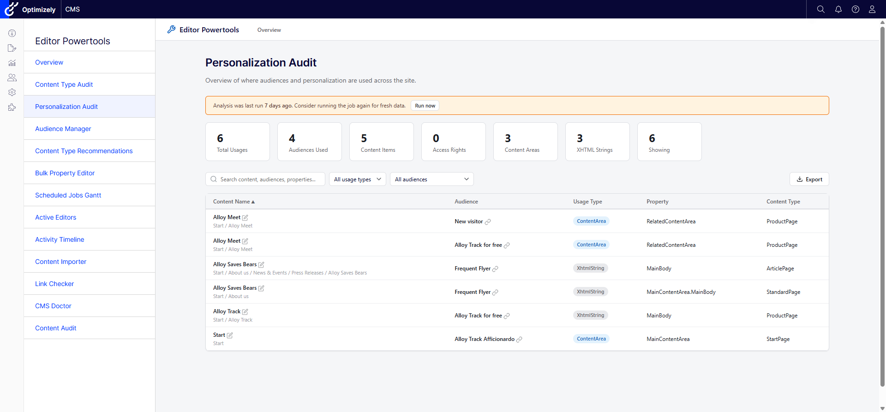

### Audience Manager
Enhanced visitor group management with search, category filtering, criteria details, and usage statistics.

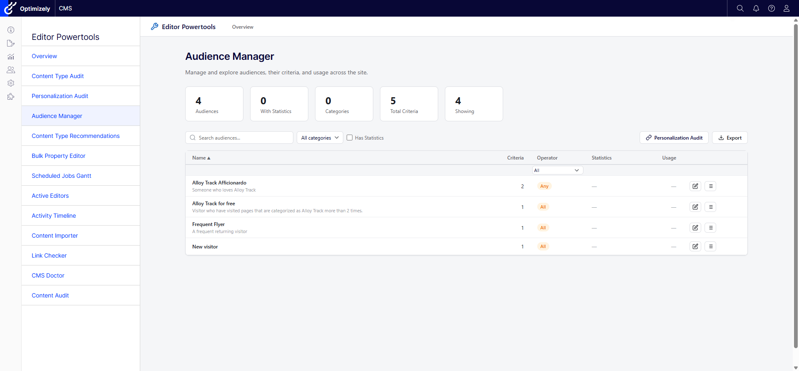

### Activity Timeline
Full timeline of editorial activities with dual-column layout, comments, version comparison, and infinite scroll.

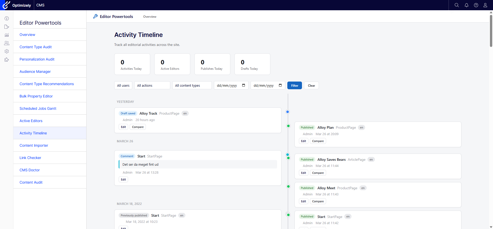

### Scheduled Jobs Gantt
Interactive Gantt chart of scheduled job execution history with zoom, scroll, duration display, and planned future runs.

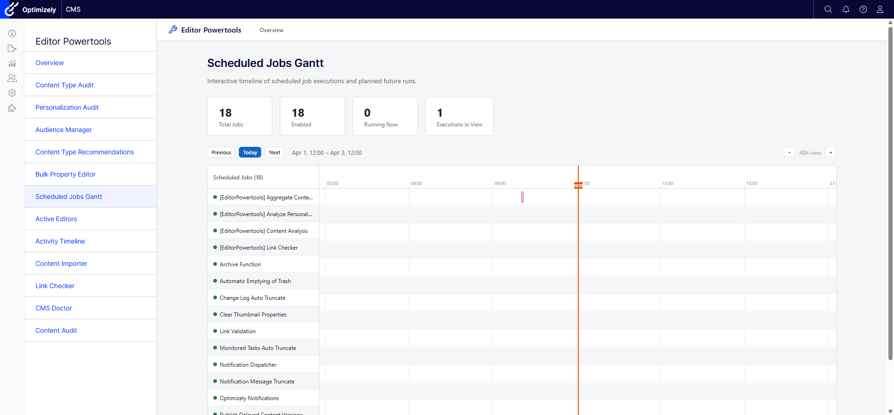

### Bulk Property Editor
Inline-edit property values across multiple content items with filtering, sorting, pagination, and bulk save/publish.

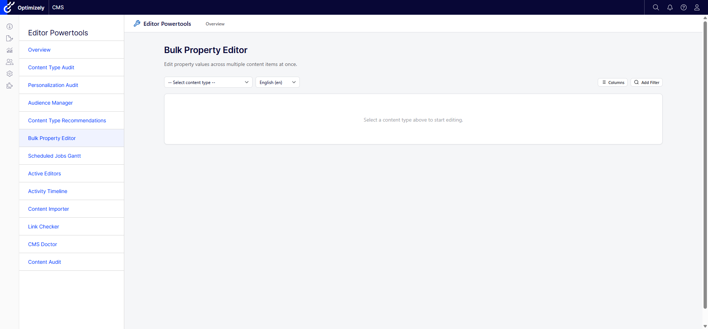

### CMS Doctor
Pluggable health check dashboard with grouped checks, status indicators, and auto-fix capabilities.

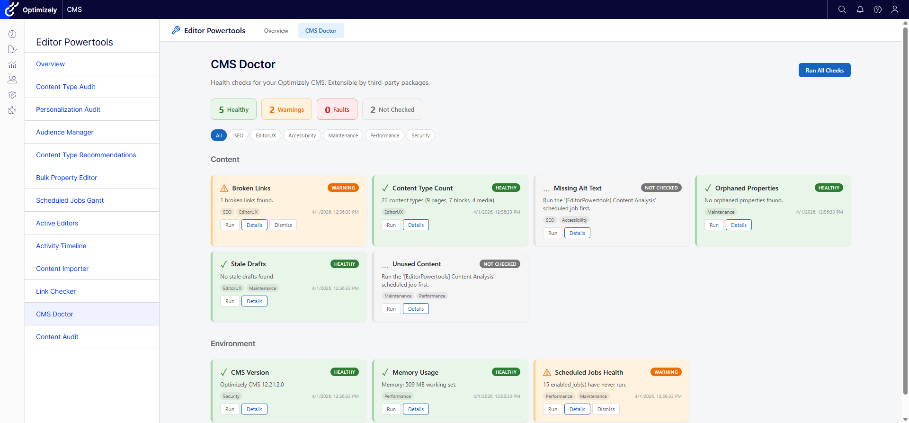

### Link Checker
Scan content for broken internal and external links with status codes, friendly URLs, and easy navigation to edit mode.

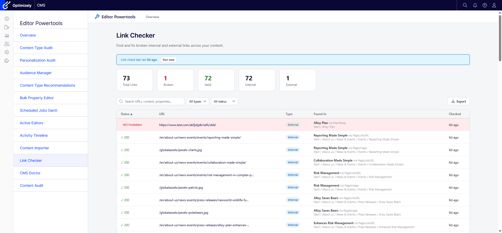

### Active Editors
Real-time editor presence awareness showing who is editing what, with team chat and CMS notifications via SignalR.

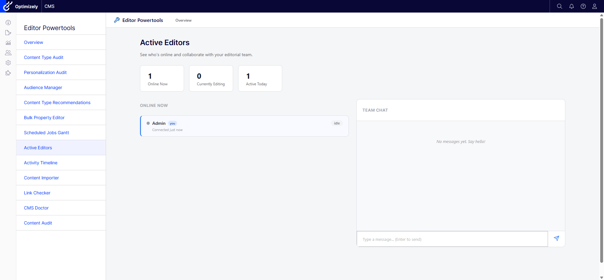

### Content Importer
Import content from CSV, Excel, or JSON with field mapping, preview, validation, and dry-run mode.

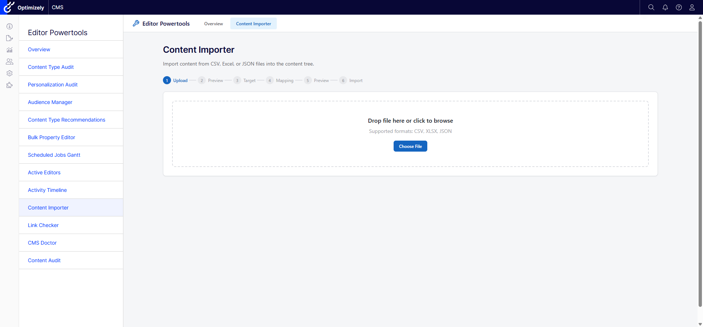

### Content Audit
Comprehensive content inventory with configurable columns, multi-column filtering, sorting, and Excel/CSV export.

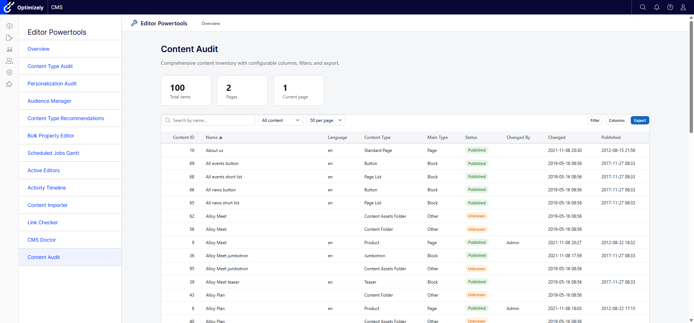

### Content Type Recommendations
Define rules for which content types are suggested when creating content under specific parent pages.

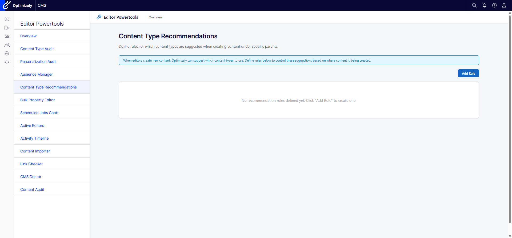

### CMS Edit Mode Integration
Power Content Details widget and Manage Children dialog integrated directly into the CMS edit mode interface.


## Installation

```
dotnet add package CodeArt.Optimizely.EditorPowertools
```

### Registration

In your `Startup.cs`:

```csharp
public void ConfigureServices(IServiceCollection services)
{
    // ... other services

    services.AddEditorPowertools(options =>
    {
        // Optional: configure roles with full access (default: WebAdmins, Administrators)
        options.AuthorizedRoles = ["WebAdmins", "Administrators"];

        // Optional: enable per-tool access control via "Permissions For Functions"
        options.CheckPermissionForEachFeature = true;

        // Optional: disable specific tools
        options.Features.BulkPropertyEditor = false;
    });
}

public void Configure(IApplicationBuilder app)
{
    // ... other middleware

    app.UseEditorPowertools();

    app.UseEndpoints(endpoints =>
    {
        endpoints.MapContent();
        endpoints.MapEditorPowertools(); // Required for Active Editors (SignalR)
    });
}
```

Or configure via `appsettings.json`:

```json
{
  "CodeArt": {
    "EditorPowertools": {
      "authorizedRoles": ["WebAdmins", "Administrators"],
      "checkPermissionForEachFeature": true,
      "features": {
        "contentTypeAudit": true,
        "personalizationUsageAudit": true,
        "bulkPropertyEditor": true
      }
    }
  }
}
```

## Permissions

Three-layer permission model:

1. **Feature Toggles** - Enable/disable individual tools via configuration
2. **Role-Based Access** - `AuthorizedRoles` grants full access (default: WebAdmins, Administrators)
3. **Permissions For Functions** - When `CheckPermissionForEachFeature = true`, individual tools can be granted to specific users/roles via the CMS admin UI under "Permissions For Functions"

## Scheduled Jobs

Several tools require a scheduled job to collect data:

| Job | Tools |
|-----|-------|
| **Aggregate Content Type Statistics** | Content Type Audit |
| **Analyze Personalization Usage** | Personalization Audit, Audience Manager |
| **Link Checker** | Link Checker |

Run these from the CMS admin Scheduled Jobs page, or trigger them from each tool's "Run now" button.

## Documentation

- [Getting Started Guide](docs/getting-started.md) - Step-by-step installation and setup
- [Configuration Reference](docs/configuration.md) - All options, feature toggles, and settings
- [Extending CMS Doctor](docs/extending-cms-doctor.md) - Create custom health checks
- [Coding Guidelines](docs/coding-guidelines.md) - Architecture patterns and coding standards
- [Backlog](docs/backlog.md) - Planned features and improvements

## Tech Stack

- .NET 8 / C# / Optimizely CMS 12 (EPiServer.CMS 12.29.0)
- Vanilla JavaScript (no framework dependencies)
- Razor SDK class library with embedded views and static assets
- DynamicDataStore (DDS) for persistence
- Protected module integration with CMS shell

## Contributing

See [docs/coding-guidelines.md](docs/coding-guidelines.md) for architecture patterns and coding standards.

## License

Proprietary - CodeArt.dk
