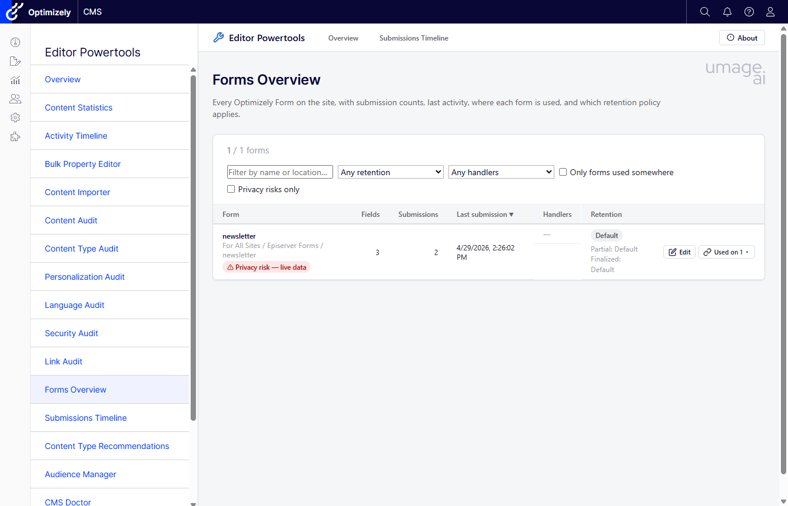
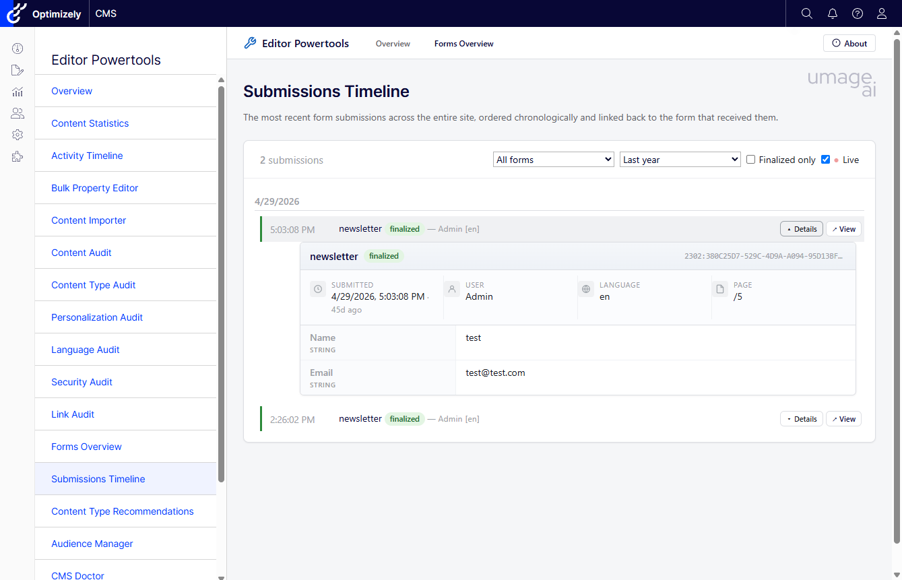

# Forms Add-On

Optimizely Forms tooling for Editor Powertools ships as a **separate, optional NuGet package** — `UmageAI.Optimizely.EditorPowerTools.Forms` — so only sites that use [Optimizely Forms](https://docs.developers.optimizely.com/content-management-system/docs/optimizely-forms) take the extra dependency.

Like the base package, it is multi-targeted and supports **Optimizely CMS 12 (.NET 8)** and **CMS 13 (.NET 10)** from a single package. It depends on the base `UmageAI.Optimizely.EditorPowerTools` package (pinned to the same version) and on `EPiServer.Forms`.

## Tools

### Forms Overview

An inventory of every Optimizely Form on the site:

- Submission counts and last-activity timestamps
- Field counts
- **Where each form is used** — incoming references from pages/blocks (expandable per row)
- Configured **notification handlers** (email / webhook)
- **Retention policy** (default vs. custom) for partial and finalized submissions
- **Duplicate-field detection** — flags forms with two or more input fields sharing a label (which collide into ambiguous submission columns)
- **Privacy / GDPR risk** — flags forms that capture PII-shaped fields **and** store submission data **and** run on the default (indefinite) retention policy; elevated to "live data" when the form is published and already holds submissions
- Filters: retention, notification handlers, usage, privacy risk, and **form language**



### Submissions Timeline

A cross-form, chronological feed of recent submissions:

- Linked back to the form that received each submission
- Optional **live mode** that streams new submissions as they arrive (Server-Sent Events)
- Per-submission detail with friendly-named field values
- Filters: form, date range, finalized/partial, and **form language**



### CMS Doctor checks

The add-on also contributes four checks to the base **CMS Doctor** dashboard:

| Check | Flags |
|-------|-------|
| **Unused Forms** | Forms not referenced by any content |
| **Forms Without Notification Handlers** | Forms receiving submissions with no email/webhook handler |
| **PII Stored Indefinitely** | Forms capturing personal data on the default (indefinite) retention policy |
| **Forms With Duplicate Fields** | Forms with two or more input fields sharing a label |

## Installation

The Forms add-on is a separate package from the base Editor Powertools package. Install **both** — the add-on declares a dependency on the base package, so a package manager will pull the base in automatically, but you register each explicitly.

```bash
dotnet add package UmageAI.Optimizely.EditorPowerTools.Forms
```

## Registration

Register the Forms add-on **after** the base package in `Startup.cs`:

```csharp
public void ConfigureServices(IServiceCollection services)
{
    // ... existing Optimizely services

    services.AddEditorPowertools();        // base package
    services.AddEditorPowertoolsForms();   // Forms add-on
}

public void Configure(IApplicationBuilder app, IWebHostEnvironment env)
{
    // ... existing middleware

    app.UseEditorPowertools();
    app.UseEditorPowertoolsForms();

    app.UseEndpoints(endpoints =>
    {
        endpoints.MapContent();
        endpoints.MapEditorPowertools();
        endpoints.MapEditorPowertoolsForms();   // maps the Forms tool endpoints
    });
}
```

All three Forms calls are required:

1. `services.AddEditorPowertoolsForms()` — registers the Forms services, options, permissions, the CMS Doctor checks, and the live-submissions broadcaster.
2. `app.UseEditorPowertoolsForms()` — middleware hook (kept for symmetry with the base package).
3. `endpoints.MapEditorPowertoolsForms()` — maps the Forms add-on's controller routes.

The Forms tools then appear in the **Editor Powertools** menu alongside the base tools.

## Configuration

Forms feature toggles are bound from the `CodeArt:EditorPowertools:Forms` configuration section (note the nested `Forms` key — separate from the base package's `CodeArt:EditorPowertools` section). Both default to enabled.

```json
{
  "CodeArt": {
    "EditorPowertools": {
      "Forms": {
        "features": {
          "formsOverview": true,
          "submissionsTimeline": true
        }
      }
    }
  }
}
```

Or in code:

```csharp
services.AddEditorPowertoolsForms(options =>
{
    options.Features.FormsOverview = true;
    options.Features.SubmissionsTimeline = false;
});
```

## Permissions

The Forms tools honor the same three-layer permission model as the base package (feature toggle → `AuthorizedRoles` → optional per-function permissions). They add two per-tool permission entries — `FormsOverview` and `SubmissionsTimeline` — which appear under **Admin → Permissions For Functions** when `CheckPermissionForEachFeature` is enabled on the base package.

## Notes

- The add-on reads form metadata and submission data; it does not modify or delete submissions.
- Localized into all 11 languages, like the base package.
- See the [Configuration Reference](configuration.md) for the base package's options.
