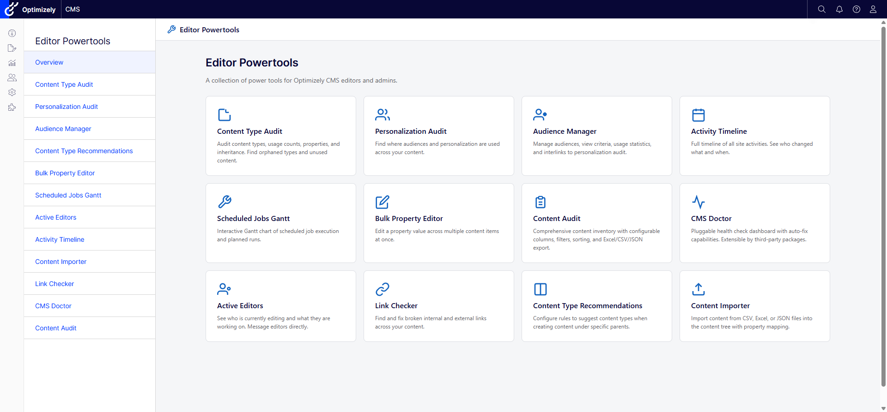
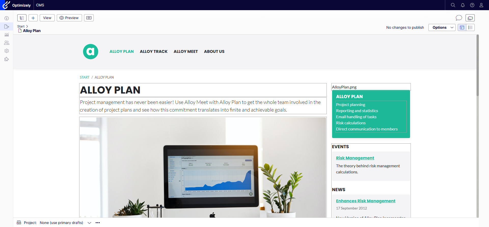

# Getting Started with EditorPowertools

This guide walks you through installing and configuring the EditorPowertools plugin for Optimizely CMS 12.

## Prerequisites

- **.NET 8 SDK** or later
- **Optimizely CMS 12** (EPiServer.CMS 12.29.0 or later)
- An Optimizely CMS 12 site project

## Step 1: Install the NuGet Package

Add the package to your CMS site project:

```bash
dotnet add package CodeArt.Optimizely.EditorPowertools
```

Or via the NuGet Package Manager in Visual Studio, search for `CodeArt.Optimizely.EditorPowertools`.

## Step 2: Register in Startup.cs

Open your site's `Startup.cs` and add the EditorPowertools registration. There are three calls required:

```csharp
using EditorPowertools.Infrastructure;

public class Startup
{
    public void ConfigureServices(IServiceCollection services)
    {
        // ... existing Optimizely services (AddCms, AddFind, etc.)

        // Register EditorPowertools with default settings
        services.AddEditorPowertools();
    }

    public void Configure(IApplicationBuilder app, IWebHostEnvironment env)
    {
        // ... existing middleware (UseStaticFiles, UseRouting, etc.)

        // Add EditorPowertools middleware
        app.UseEditorPowertools();

        app.UseEndpoints(endpoints =>
        {
            endpoints.MapContent();

            // Map EditorPowertools SignalR hubs (required for Active Editors)
            endpoints.MapEditorPowertools();
        });
    }
}
```

### Minimal registration

At minimum, you need all three calls:

1. `services.AddEditorPowertools()` -- registers services, options, and permissions
2. `app.UseEditorPowertools()` -- adds required middleware
3. `endpoints.MapEditorPowertools()` -- maps SignalR hubs for real-time features

### Registration with options

You can configure options inline:

```csharp
services.AddEditorPowertools(options =>
{
    // Restrict access to specific roles
    options.AuthorizedRoles = ["WebAdmins", "Administrators"];

    // Enable per-tool permissions via CMS admin UI
    options.CheckPermissionForEachFeature = true;

    // Disable tools you don't need
    options.Features.ContentImporter = false;
    options.Features.BulkPropertyEditor = false;
});
```

## Step 3: Configure via appsettings.json (Optional)

Instead of (or in addition to) code-based configuration, you can use `appsettings.json`. Settings are read from the `CodeArt:EditorPowertools` section:

```json
{
  "CodeArt": {
    "EditorPowertools": {
      "authorizedRoles": ["WebAdmins", "Administrators"],
      "checkPermissionForEachFeature": false,
      "features": {
        "contentTypeAudit": true,
        "personalizationUsageAudit": true,
        "contentTypeRecommendations": true,
        "audienceManager": true,
        "contentDetails": true,
        "brokenLinkChecker": true,
        "bulkPropertyEditor": true,
        "scheduledJobsGantt": true,
        "activityTimeline": true,
        "contentImporter": true,
        "manageChildren": true,
        "contentAudit": true,
        "cmsDoctor": true,
        "activeEditors": true,
        "activeEditorsChat": true
      }
    }
  }
}
```

Code-based options (from `AddEditorPowertools(options => ...)`) take precedence over `appsettings.json` values.

## Step 4: Run the Aggregation Scheduled Job

Several tools depend on pre-computed data that is gathered by scheduled jobs. After installation, navigate to the CMS admin area and run these jobs:

1. Go to **Admin** > **Scheduled Jobs**
2. Find and run **[EditorPowertools] Content Analysis** -- this is the unified job that collects data for Content Type Audit, Personalization Audit, Link Checker, and CMS Doctor checks that require content traversal
3. Optionally schedule it to run periodically (e.g., nightly) to keep data fresh

You can also trigger the job from each tool's UI using the "Run now" button, if one is provided.

### Which tools need the scheduled job?

| Tool | Requires Scheduled Job |
|------|----------------------|
| Content Type Audit | Yes -- content type usage counts |
| Personalization Audit | Yes -- scans for visitor group usage |
| Link Checker | Yes -- discovers and validates links |
| CMS Doctor | Partially -- some checks use analyzer data |
| All other tools | No -- work in real-time |

## Step 5: Navigate to the Tools

Once registered, EditorPowertools adds a top-level menu item in the CMS navigation bar:

1. Log in to the Optimizely CMS admin/edit interface
2. Look for **Editor Powertools** in the top navigation menu
3. Click it to see the overview dashboard with all available tools



Each tool is a card on the dashboard. Click a tool card to open it.

### CMS Edit Mode Widgets

Some tools integrate directly into the CMS edit mode:

- **Power Content Details** -- appears as a widget in the assets panel, showing detailed info about the currently selected content item
- **Manage Children** -- available from the content tree context menu to perform bulk operations on child items
- **Active Editors** -- shows real-time editor presence in a sidebar widget



## Next Steps

- [Configuration Reference](configuration.md) -- full details on all options, feature toggles, and permission settings
- [Extending CMS Doctor](extending-cms-doctor.md) -- create custom health checks for your site
- [Coding Guidelines](coding-guidelines.md) -- architecture and standards for contributing
